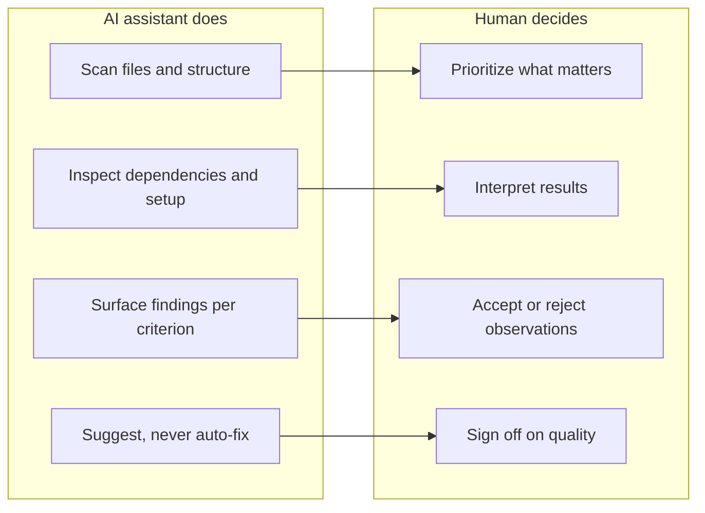

# Aluci Label Helper

[](LICENSE)

## Overview

A repo with different commands for [Claude Code](https://docs.anthropic.com/en/docs/claude-code), [OpenCode](https://opencode.ai/) and other alternatives, acting as helpers for the [Aluci labeling](https://github.com/AluciTech/aluci-label) committee. It explores a repository, gathers evidence against the [Aluci label criteria](https://github.com/AluciTech/aluci-label/blob/main/CRITERIA.md), and produces structured notes so human reviewers can work better and focus on judgment calls.

This is **not** an automated pipeline: it surfaces facts and flags concerns. The final verdict is always made by humans.



## Setup

### Requirements

- [Claude Code](https://docs.anthropic.com/en/docs/claude-code), [OpenCode](https://opencode.ai/) or any other alternative

### Installation

From the root of the repository you want to review, run the install script with the destination folder for your tool:

```bash
curl -fsSL https://github.com/AluciTech/aluci-label-helper/releases/latest/download/install.sh | bash -s -- .claude/
```

The script appends `commands/` automatically, so `-- .claude/` installs into `.claude/commands/`.

To pin a specific version:

```bash
curl -fsSL https://github.com/AluciTech/aluci-label-helper/releases/latest/download/install.sh | bash -s -- --version v1.0.0 .claude/
```

This downloads all available commands into the target directory. No other dependencies are required.

## Available commands

| Command | Description |
|---------|-------------|
| `/pre-review` | Scans a repo against Aluci label criteria and produces structured notes for human reviewers |

More commands will be added over time. Re-run the install script to get the latest set.

## Usage

From the target repository, invoke any installed command. For example:

```bash
/pre-review
```

Each command is a standalone `.md` file living in your tool's commands directory (`.claude/commands/` or `.opencode/commands/`).

## Maintainers

### Releasing a new version

1. Make sure all changes are committed and pushed to `main`.
2. Tag the commit and push the tag:

   ```bash
   git tag v1.1.0
   git push origin v1.1.0
   ```

3. The `release` workflow will automatically create a GitHub Release with `install.sh` attached as a downloadable asset.

## License

This project is licensed under the Apache License (Version 2.0).

See the [LICENSE](LICENSE) file for details.

## AI Usage Transparency

This project uses AI tools to assist with development.
For more details, see the [AI Usage Disclosure](AI_USAGE.md) file.
